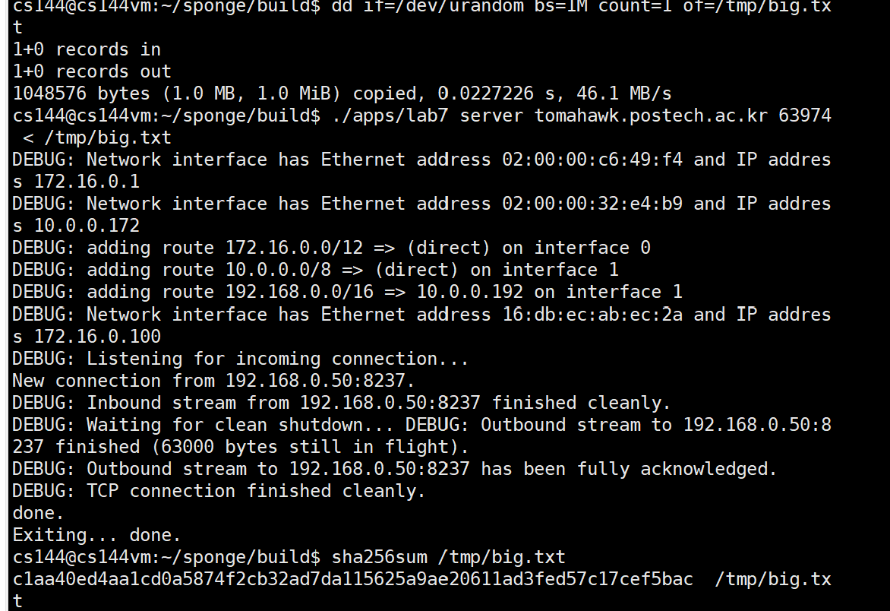
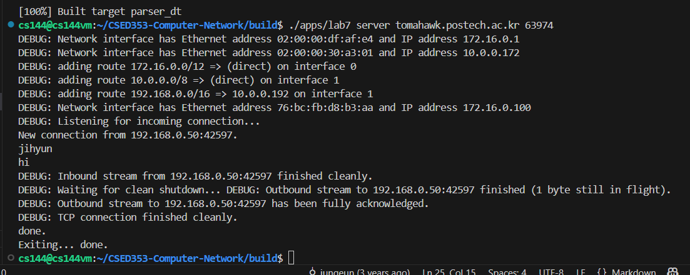

Assignment 7 Writeup
=============

My name: Ko Minseok

My POVIS ID: koms0109

My student ID (numeric): 20220615

My assignment partner's name: Kim Jihyun

My assignment partner's POVIS ID: jihyunk

My assignment partner's ID (numeric): 20220302

This assignment took me about 1 hours to do (including the time on studying, designing, and writing the code).

If you used any part of best-submission codes, specify all the best-submission numbers that you used (e.g., 1, 2): []

- **Caution**: If you have no idea about above best-submission item, please refer the Assignment PDF for detailed description.

Solo portion:
My implementation successfully started and ended a conversation with another copy of itself. It also successfully transfered a one-megabyte file, with contents identical upon receipt.
- Connection - Client

- Connection - Server

- Sending file - Client

- Sending file - Server

Group portion:
Team Name: Metcalfe Partner name/POVIS ID: Kim Jihyun/jihyunk
Our implementations successfully started and ended a conversation with each other. They also successfully transfered a one-megabyte file between our two implementations, with contents identical upon receipt.
- Connection - Client

- Connection - Server

- Sending file - Client

- Sending file - Server

Swap Role:
- Connection - Client

- Connection - Server

- Sending file - Client

- Sending file - Server

Creative portion (optional):
[]

Other remarks:
[]

- Optional: I had unexpected difficulty with: [describe]

- Optional: I think you could make this assignment better by: [describe]

- Optional: I was surprised by: [describe]

- Optional: I'm not sure about: [describe]
